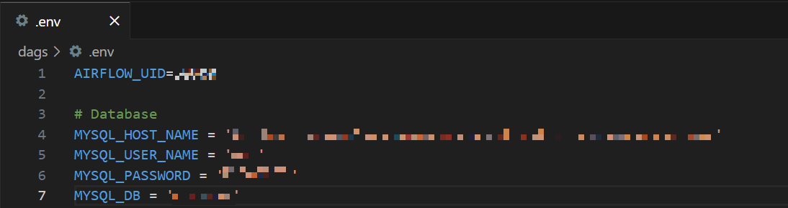

## Front Docker 실행

```bash
docker build -t emobank-front . 
docker run -d -p 80:3000 --name fe-emobank emobank-front
```

## Airflow (local 환경) 실행
- 환경
    - GPU
    - WSL

1. **파이썬 버전 확인**
    
    ```bash
    python --version
    ```
    
    3.10 이상 환경 필요  

    
    +) 없는 경우 파이썬 다운로드
    
    Python3.10에 지원하는 "dev", "venv" 패키지만 설치 버전으로 진행
    
    참고자료  
    [[Python] Ubuntu 18.04 파이썬 3.10 버전 설치 및 기본 설정하기](https://dev-blackcat.tistory.com/2)
    
    ```bash
    sudo update-alternatives --install /usr/bin/python python /usr/bin/python3.10 1
    ```
    
2. **가상환경 설정**
    
    1) 가상환경 내 파이썬 버전 다시 확인
    
    2) 가상환경 생성, 활성화
    
        ```bash
        python -m venv venv
        source venv/bin/activate
        ```
    
3. **airflow 설치**
    
    1) airflow 경로 설정
    
        ```bash
        export AIRFLOW_HOME=~/airflow
        ```
    
    2) airflow 설치
    
        ```bash
        AIRFLOW_VERSION=2.8.4
        
        PYTHON_VERSION="$(python --version | cut -d " " -f 2 | cut -d "." -f 1-2)"
        
        CONSTRAINT_URL="https://raw.githubusercontent.com/apache/airflow/constraints-${AIRFLOW_VERSION}/constraints-${PYTHON_VERSION}.txt"
        
        pip install "apache-airflow==${AIRFLOW_VERSION}" --constraint "${CONSTRAINT_URL}"
        ```
    
        [Quick Start — Airflow Documentation](https://airflow.apache.org/docs/apache-airflow/stable/start.html)
        
        [[Airflow] Linux(Ubuntu)환경에서 Airflow 설치](https://yong27.tistory.com/47)
    
4. **파일 옮기기**
    
    1) 현재 주소 확인
    
        ```bash
        curl ifconfig.me
        ```
    
    2) 파일을 받고 싶은 곳에서 설정
    
    3) 파일을 주고 싶은 곳에서 sftp 연결
    
    4) 파일 업로드
    
    [sftp](https://www.notion.so/sftp-98fdbf4d531943d883b75370a7c8a868?pvs=21)
    
    파일 업로드의 경우 권한 문제가 존재 시 sudo chmod 777 사
    
    +) git에서 바로 clone 가능
    
5. **.env 파일 설정**
    
    dags 파일 내에 연결할 DB의 .env 파일 
    
    
    
6. **requirements 설치**
    
    requirements의 경우 의존성 버전 충돌을 막기 위해 단계를 나누어 작성
    
    순서대로 설치 중요
    
    ```bash
    pip install -r requirements1.txt
    pip install -r requirements2.txt
    
    // requirements3.txt 안의 내용 복사하여 실행 
    pip3 install torch torchvision torchaudio --index-url https://download.pytorch.org/whl/cu118
    
    pip install -r requirements4.txt
    ```
    
    혹시 pycairo 문제 발생 시 아래의 명령어로 설치 후 진행
    
    ```bash
    sudo apt install libcairo2-dev pkg-config python3-dev
    ```
    
    혹시 importlib-metadata 관련 에러 발생 시 아래 버전 다시 설치 후 진행
    
    ```bash
    ERROR: pip's dependency resolver does not currently take into account all the packages that are installed. This behaviour is the source of the following dependency conflicts.
    opentelemetry-api 1.23.0 requires importlib-metadata<7.0,>=6.0, but you have importlib-metadata 4.6.4 which is incompatible.
    apache-airflow-providers-common-sql 1.11.1 requires more-itertools>=9.0.0, but you have more-itertools 8.10.0 which is incompatible.
    ```
    
    ```bash
    pip install importlib-metadata==4.6.4
    ```
    
7. **airflow 실행**
    
    ```bash
    airflow webserver --port 8080
    airflow scheduler
    ```
    

8. **airflow webserver 확인**
    
    ```bash
    localhost:8080
    ```